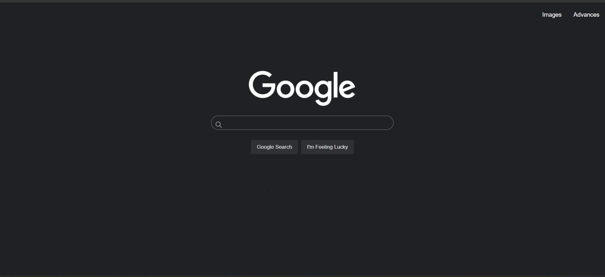
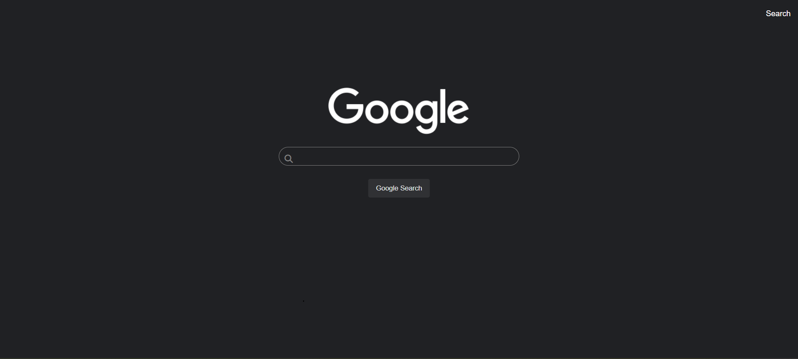
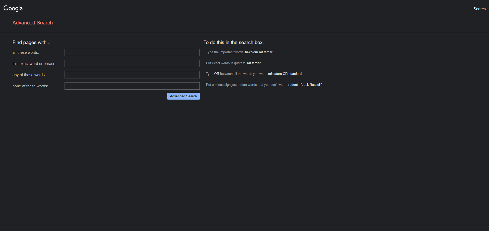

# Project 0 - Search

This is my first project in my CS50’s Web Programming with Python and JavaScript course that I taken. In this project, I have to replicate the functinallity of google search, google image search, and google search advance using only html and css

## Specification

* The website have at three pages: one for regular Google Search, one for Google Image Search, and one for Google Advanced Search.
    

    * On the Google Search page, there are links in the upper-right of the page to go to Image Search or Advanced Search. On each of the other two pages, there is a link in the upper-right to go back to Google Search.

* On the Google Search page, the user able to type in a query, click “Google Search”, and be taken to the Google search results for that page.

* On the Google Image Search page, the user able to type in a query, click a search button, and be taken to the Google Image search results for that page.

* On the Google Advanced Search page, the user able to provide input for the following four fields

    * Find pages with… “all these words:”
    * Find pages with… “this exact word or phrase:”
    * Find pages with… “any of these words:”
    * Find pages with… “none of these words:”

* The last functionality, “I’m Feeling Lucky” button to the main Google Search page. Consistent with Google’s own behavior, clicking this link should take users directly to the first Google search result for the query, bypassing the normal results page.

## Pages

### Regular Google Search 

### Google Image Search

### Google Advanced Search

